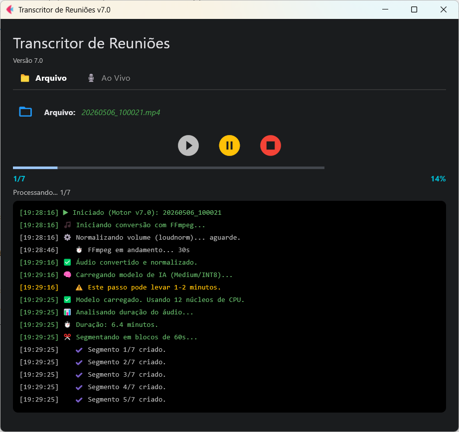
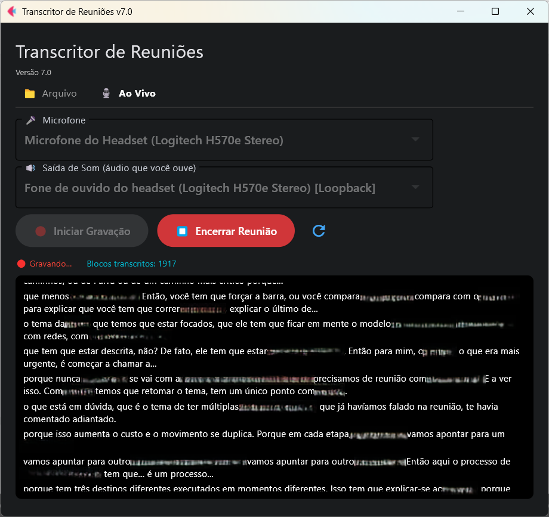

# 🎙️ Transcritor de Reuniões v7.0 (Faster-Whisper)

O **Transcritor de Reuniões** é uma ferramenta de alta performance para conversão de áudio em texto, focada em privacidade total (100% offline) e precisão gramatical para o português do Brasil.

Utiliza o motor **Faster-Whisper (CTranslate2)**, otimizado para rodar em CPUs comuns com baixo consumo de memória RAM.

[](https://ko-fi.com/jparias)

| Aba Arquivo | Aba Ao Vivo |
|:-----------:|:-----------:|
|  |  |

---

## ✨ Destaques da Versão 7.0
- **Modo Ao Vivo (novo):** Captura microfone + saída de som do headset simultaneamente durante a reunião, gerando a transcrição em tempo real em blocos de 10 segundos.
- **Modo Arquivo (mantido):** Transcreve gravações existentes (MP4, MP3, WAV, etc.) com controle de Play, Pause e Stop.
- **Seleção de dispositivos:** Dropdowns para escolher microfone e saída de som — sem suposições automáticas.
- **Console por aba:** Cada aba tem sua própria área de saída — a aba **Arquivo** exibe logs técnicos do processo (FFmpeg, segmentos, tempo); a aba **Ao Vivo** exibe o texto transcrito em tempo real, parágrafo a parágrafo, sem ruído técnico.
- **Motor:** Faster-Whisper (implementação CTranslate2 otimizada).
- **Modelo:** `Medium` (equilíbrio ideal entre velocidade e precisão para Português).
- **Equalização e Normalização:** Pré-processamento via FFmpeg para melhorar a clareza da voz.
- **Segmentação:** Blocos de 60s (Arquivo) ou 10s (Ao Vivo), garantindo estabilidade de memória.
- **Privacidade:** 100% Offline. Nenhum dado ou áudio sai da sua máquina.
- **Instalador:** Setup.exe com wizard next-next-finish, sem necessidade de configuração manual.

---

## 💾 Instalação (usuário final)

1. Baixe o arquivo `Setup_Transcritor_v7.exe` na seção [Releases](../../releases)
2. Execute o instalador e siga os passos (next → next → finish)
3. Um atalho será criado no Menu Iniciar e, opcionalmente, na área de trabalho

**Não é necessário instalar Python, FFmpeg ou qualquer dependência. Tudo já está incluso.**

### Onde os arquivos ficam após a instalação

```
C:\Users\[seu usuário]\AppData\Local\Transcritor\   ← app (automático)
C:\Users\[seu usuário]\Documents\Transcritor\
    output\   ← transcrições geradas ✅
    logs\     ← logs de execução
    temp\     ← arquivos temporários
```

---

## 🛠️ Requisito Externo: FFMPEG (apenas para desenvolvimento)

O transcritor depende da ferramenta **FFmpeg** para equalizar e segmentar as gravações. No instalador ele já está incluído. Para o ambiente de desenvolvimento:

1. **Download:** [Gyan.dev - FFmpeg Shared Build](https://www.gyan.dev/ffmpeg/builds/packages/ffmpeg-8.0.1-full_build-shared.7z)
2. **Instalação:** Extraia os arquivos em `C:\ffmpeg`.
3. **Variável de Ambiente:** Adicione `C:\ffmpeg\bin` à variável de ambiente `PATH` do seu Windows.

---

## 🏗️ Ambiente de Desenvolvimento

Para garantir a compatibilidade, utilize o **Python 3.11.9**. Siga os passos abaixo no PowerShell:

1. **Crie e Ative o Ambiente Virtual:**
```powershell
py -3.11 -m venv venv
.\venv\Scripts\Activate.ps1
```

2. **Configure as Permissões (se necessário):**
```powershell
Set-ExecutionPolicy -Scope CurrentUser -ExecutionPolicy RemoteSigned
```

3. **Instale as Dependências:**
```powershell
python -m pip install --upgrade pip
python -m pip install torch==2.10.0           # fundação — instalar primeiro
python -m pip install faster-whisper          # depende do torch
python -m pip install flet==0.22.0            # interface
python -m pip install pydub==0.25.1
python -m pip install numpy==2.3.5
python -m pip install pyaudiowpatch           # captura de áudio ao vivo (WASAPI)
python -m pip install tqdm==4.67.3
python -m pip install requests==2.32.5
python -m pip install regex==2026.1.15
python -m pip install pylint nuitka
```

---

## 🤖 Modelo de IA (Weights)

O motor Faster-Whisper requer os pesos do modelo convertidos para o formato CTranslate2.
1. Crie a pasta `.\modelos\medium` na raiz do projeto.
2. Baixe os arquivos do repositório [Faster-Whisper Medium (Hugging Face)](https://huggingface.co/guillaumekln/faster-whisper-medium/tree/main):
   - `config.json`
   - `model.bin`
   - `tokenizer.json`
   - `vocabulary.txt`

---

## 📦 Geração do Executável e Distribuição

### Pré-requisitos
- [Inno Setup 6](https://jrsoftware.org/isinfo.php) instalado
- FFmpeg extraído em `C:\ffmpeg`
- Pasta `modelos\medium\` com os arquivos do modelo

### Gerar compilação + instalador (processo completo)
```powershell
.\build_v7.ps1
```

### Gerar apenas o instalador (build Nuitka já existente)
```powershell
.\build_inno.ps1
```

O instalador final é gerado em `installer\Output\Setup_Transcritor_v7.exe`.

### Estrutura do projeto
```text
transcritor/
├── transcritor_v7.py         ← código principal
├── build_v7.ps1              ← build completo (Nuitka + Inno Setup)
├── build_inno.ps1            ← só o instalador
├── transcritor.ico
├── replace.txt               ← dicionário de correções (opcional)
├── modelos/medium/           ← arquivos do modelo Whisper
├── installer/
│   └── setup_transcritor.iss ← script Inno Setup
└── venv/                     ← ambiente virtual Python
```

---

## 📝 O Dicionário (replace.txt)

A IA pode confundir termos técnicos devido a sotaques ou regionalismos. O arquivo `replace.txt`, colocado na mesma pasta do executável, corrige automaticamente o texto final após a transcrição.

**Formato:**
```
PalavraCorreta: erro1, erro2, "erro com espaço", erro3
```

**Exemplos reais coletados em meses de uso:**
```
Fortinet: "Fortune Net", fortune, Forchimetchi, footnet, Fortunet, FATnet, forxinete, portinete, Forcingetor, forcinezzi, fortuguete, Forçineci, Fortuny, Forcinecci

Hostname: Hostingame, Hostineimi, "Hosting Nemi", "hosting NAME", "Hosting Amy", Hostinemi, Roshinemi, Jostinemi, "Hosting Name", "Hostie Neymi", HostingM, postinemi, Hostiname, hostiname, Postinéimi, rosteiro, Rochname, "Rush Name", "Hosting Naming", HostingAmy, "hoste name", hostine, Rostini, Hostnameme, "Hosting M", "Hostie Neme", "Justin Emy", gostinemi

Site: Saiti, Saici, Sáici, Saichi

Cloud: Claudio, Claudi

device: devais
```

Enriqueça o arquivo conforme novos erros forem detectados nas transcrições.

---

## 🧠 Pós-Processamento: Resumo e Ata com IA

Utilize os prompts abaixo em uma IA (ChatGPT, Claude, Gemini) para transformar a transcrição bruta em uma ata executiva:

### Passo 1 — Resumo Técnico

> O anexo contém a transcrição de uma reunião sobre [assunto]. O título da reunião é "[título]". Atue como um consultor sênior em [especialidade], com visão técnica e operacional. Preciso que analise e gere um resumo bem sucinto dos assuntos discutidos e, no final, descreva qual foi a conclusão da reunião e quais serão os próximos passos. Tudo isso descrito no formato de redação, eliminando redundâncias e se houver algum trecho em inglês ou espanhol, traduzir para o português do Brasil.

### Passo 2 — Ata Estruturada

> Agora, baseado apenas no resumo gerado acima, gere uma ata no formato estruturado em tópicos, seguindo rigorosamente o modelo abaixo.
>
> Diretrizes obrigatórias:
> - Não escrever em formato de redação corrida
> - Utilizar sempre tópicos e subtópicos
> - Não utilizar numeração nos tópicos, apenas marcadores (•, ◦, etc.)
> - Eliminar redundâncias e falas repetidas
> - Traduzir para o português do Brasil qualquer trecho em inglês ou espanhol
> - Evidenciar o entendimento comum como "Entendimento Compartilhado" (não "Decisões", pois os participantes têm poder de posicionamento e sugestão, não de decisão)
> - Destacar pontos de atenção, se houverem
>
> ```
> Pontos Principais Discutidos
>
> Tópico discutido 1
>   - Detalhamento objetivo
>   - Posicionamento, orientações, questionamentos ou riscos
>
> Tópico discutido n
>   - Detalhamento objetivo
>   - Posicionamento, orientações, questionamentos ou riscos
>
> Entendimento Compartilhado
>   - Item 1
>   - Item n
>
> Conclusão
>   - Síntese objetiva do alinhamento da reunião
>   - Pontos de atenção, se houverem
>
> Próximos Passos (tabela: Ação | Responsável | Previsão)
> ```

Por fim, cole o resultado em e-mail, mencione os participantes e envie para todos os convocados.

---

## ⚖️ Licença (MIT)

Copyright (c) 2025 João Arias

Permission is hereby granted, free of charge, to any person obtaining a copy of this software and associated documentation files (the "Software"), to deal in the Software without restriction, including without limitation the rights to use, copy, modify, merge, publish, distribute, sublicense, and/or sell copies of the Software, and to permit persons to whom the Software is furnished to do so, subject to the following conditions:

The above copyright notice and this permission notice shall be included in all copies or substantial portions of the Software.

THE SOFTWARE IS PROVIDED "AS IS", WITHOUT WARRANTY OF ANY KIND, EXPRESS OR IMPLIED, INCLUDING BUT NOT LIMITED TO THE WARRANTIES OF MERCHANTABILITY, FITNESS FOR A PARTICULAR PURPOSE AND NONINFRINGEMENT. IN NO EVENT SHALL THE AUTHORS OR COPYRIGHT HOLDERS BE LIABLE FOR ANY CLAIM, DAMAGES OR OTHER LIABILITY, WHETHER IN AN ACTION OF CONTRACT, TORT OR OTHERWISE, ARISING FROM, OUT OF OR IN CONNECTION WITH THE SOFTWARE OR THE USE OR OTHER DEALINGS IN THE SOFTWARE.

---
*"Reto é o passo do justo; reto é o seu caminho."*
